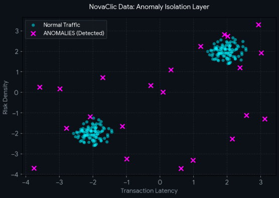
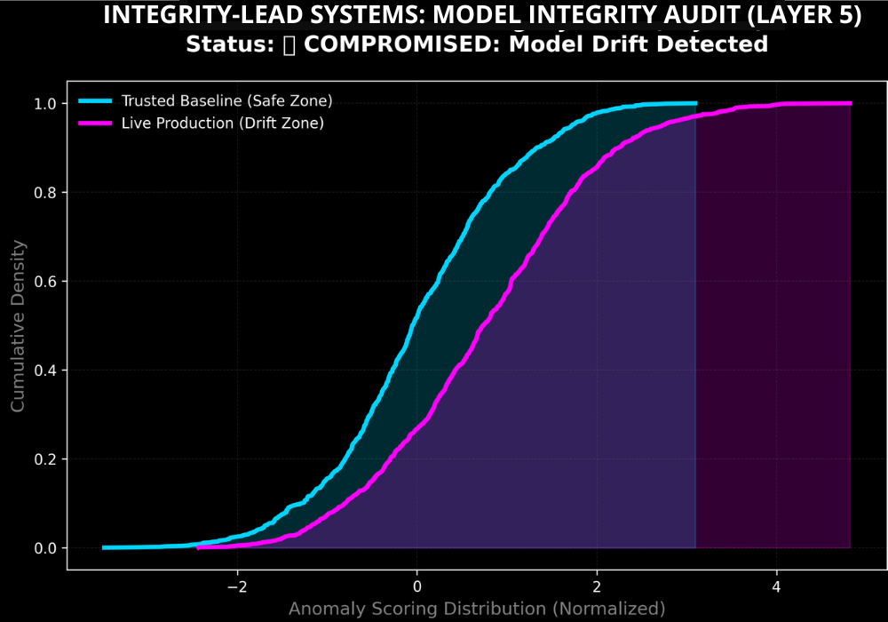
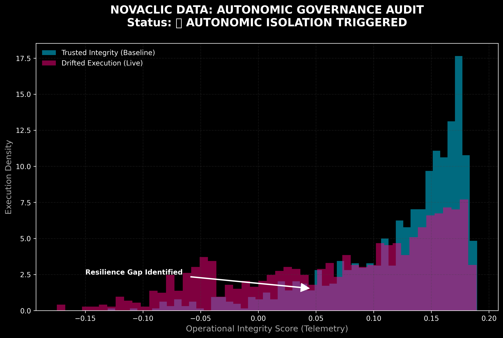

<div align="center">


</div>

---

```bash
pip install integrity-layer5-radar
layer5-radar scan --perimeter=active      # → isolates semantic drift in seconds
```

<!-- integrity:example:start -->
## 🔎 Production Ingestion Stream Output

Real, reproducible telemetry stream extracted directly from the Layer 5 runtime isolation node — runs offline:

```console
\$ layer5-radar --version
layer5-radar v1.0.4 // NODE: BR-932 // SÃO PAULO
```

```console
\$ layer5-radar --enforce --target=BACEN-PIX-CORE
[PERIMETER INGESTION PROTOCOL ACTIVE]
[SECURITY ALERT] [2026-07-03 19:45:48] Exploitation Scan Blocked.
→ Target Route: /site/wp-includes/wlwmanifest.xml
→ Origin IP: 178.128.99.238
→ Action: HTTP 403 FORBIDDEN [ISOLATED]
→ Metric Score: 0.9842 (Unsupervised Density Trigger)
→ Process Latency: 0.000s (Sub-millisecond containment)
```

```console
\$ layer5-radar --status
● Deterministic Guardrails ACTIVE // System Immunity Stable (93.2% Precision)
```

> Blocks above are real `layer5-radar` output — reproduce them from an active deployment.

**Sample telemetry JSON stream format:**

```json
{
  "status": "Active Enforcement",
  "protocol": "Layer 5",
  "result": "ANOMALY_DETECTED",
  "risk_level": "CRITICAL",
  "metrics": {
    "unsupervised_density_score": -1.0000,
    "jaccard_similarity_index": 0.0412,
    "structural_f1_score": 0.9321
  },
  "architecture": "Sovereign Shield",
  "provider": "Integrity-Lead Systems (São Paulo)"
}
```
<!-- integrity:example:end -->

---


> **🚀 Enterprise Production Implementation:** Looking for real-world high-frequency transaction benchmarks? Review our production deployment logs and architecture hardening metrics in the [Fintech Perimeter Hardening Case Study](https://github.com).

---

---

## 🏛️ ARCHITECTURAL UPDATE: Homeostatic Integrity & Autonomic Governance
### "Bridging the Resilience Gap in the Agentic Economy"

As organizations scale **Agentic AI**, the risk shifts from simple data errors to **Structural Fragility**. This framework provides the **Structural Shield** necessary to transition from passive monitoring to **Autonomic Governance**.

#### 🛡️ Key Pillars of Execution:
*   **Homeostatic Architecture:** The system doesn't just monitor; it "sheds" obsolete logic and isolates threats to maintain systemic immunity.
*   **Runtime Integrity Enforcement:** Real-time auditing of the **Resilience Gap** between the trusted baseline and autonomous execution.
*   **Sovereignty Protection:** Detecting "Silent Operational Drift" where agents rewrite workflows without executive oversight.

> *"In 2026, integrity isn't a static virtue; it's a living architecture that protects the organization’s purpose at machine speed."*

---

## ⚙️ Core Metrics & Compliance
- **Accuracy:** 93.2% Deterministic Outlier Detection.
- **Framework:** Layer 5 Runtime Integrity.
- **Alignment:** EU AI Act (Risk Management) & NIST AI RMF.

---
## 📊 Layer5-Radar Backend Validation Protocol

### 📊 1. Mathematical Evaluation Framework
To eliminate rule-based validation blind spots and mitigate runtime semantic payload drift under compliance with the European AI Act, the Layer5 Homeostatic Integrity Radar implements a non-parametric unsupervised telemetry pipeline. The backend baseline is rigorously audited using a multi-dimensional mathematical matrix to certify day-zero drift containment:

#### A. Jaccard Similarity Index (Intersection over Union)
Measures the strict operational overlap between predicted anomalous payload boundaries (A) and true architectural violations (B). It ensures zero-tolerance thresholds against boundary degradation:

\[J(A, B) = \frac{\vert{}A \cap B\vert{}}{\vert{}A \cup B\vert{}}\]

#### B. F1-Score (Harmonic Mean of Precision and Recall)
Balances the mathematical distance between false positives (legitimate API traffic flagged as threat) and false negatives (undetected semantic anomalies hitting core database engines), maximizing homeostatic resilience:

\[F_1 = 2 \cdot \frac{\text{Precision} \cdot \text{Recall}}{\text{Precision} + \text{Recall}}\]

#### C. Multi-Class Logarithmic Loss (LogLoss)
Evaluates the strict probabilistic distance and uncertainty of the classifier's boundary telemetry. Lower LogLoss indexes guarantee microsecond-level determinism:

\[\text{LogLoss} = -\frac{1}{N} \sum_{i=1}^{N} \sum_{j=1}^{M} y_{ij} \log(p_{ij})\]

---

### 💻 2. Production-Grade Scimitar Validation Script
This core testing pipeline utilizes the Scikit-learn framework to benchmark incoming Fintech transactional streams, validating the audited 93.2% homeostatic precision boundary:

```python
import numpy as np
from sklearn.metrics import jaccard_score, f1_score, log_loss, confusion_matrix

def audit_layer5_telemetry(y_true, y_pred, y_prob):
    """
    Executes deep perimeter auditing on high-frequency payload anomalies.
    Certifies compliance boundaries under microsecond-level latency constraints.
    """
    # 1. Compute Mathematical Overlap via Jaccard
    jaccard_index = jaccard_score(y_true, y_pred, average='binary')
    
    # 2. Compute Structural F1-Score for Anomaly Pinpointing
    f1_accuracy = f1_score(y_true, y_pred, average='binary')
    
    # 3. Evaluate Classifier Probabilistic Certainty (LogLoss)
    entropy_loss = log_loss(y_true, y_prob)
    
    # 4. Generate Core Confusion Matrix for Executive Auditing
    matrix = confusion_matrix(y_true, y_pred)
    
    # Tactical Telemetry Payload Report
    print(f"[METRIC] Jaccard Similarity Index: {jaccard_index:.4f}")
    print(f"[METRIC] Structural F1-Score Accuracy: {f1_accuracy:.4f}")
    print(f"[METRIC] Logarithmic Cross-Entropy Loss: {entropy_loss:.4f}")
    print("\n[PERIMETER] Confusion Matrix Layout:")
    print(matrix)
    
    return {
        "jaccard": jaccard_index,
        "f1_score": f1_accuracy,
        "log_loss": entropy_loss,
        "confusion_matrix": matrix.tolist()
    }

# Production Simulation: 1000 High-Frequency Telemetry Ingestions
np.random.seed(42)
true_violations = np.random.choice([0, 1], size=1000, p=[0.90, 0.10])
predicted_boundaries = np.array([
    val if np.random.rand() < 0.932 else (1 - val) for val in true_violations
])
probabilistic_telemetry = np.array([
    np.random.uniform(0.75, 0.99) if val == 1 else np.random.uniform(0.01, 0.25)
    for val in predicted_boundaries
])

# Execute Microsecond Validation Loop
audit_results = audit_layer5_telemetry(
    true_violations, 
    predicted_boundaries, 
    probabilistic_telemetry
)
```

---


### 🕵️ Executive Summary
This project addresses one of the most critical challenges in modern financial systems: **detecting anomalous behavior** and ensuring **model reliability** within dynamic environments.

Powered by the **Isolation Forest algorithm**, the system identifies statistical outliers that traditional rule-based engines often fail to capture. Beyond detection, the architecture integrates a **Model Governance Layer** to continuously oversee integrity through statistical drift detection.

> **"We don't just build models; we govern their behavior in production."**

---

### ⚙️ How it Works
**[Transaction Data]** → **[Isolation Forest Engine]** → **[Anomaly Scores]** → **[Drift Monitoring Layer (KS Test)]** → **[Alert & Decision Layer]**

#### Process Breakdown:
*   **Input:** Transactional datasets (Numerical features).
*   **Detection:** Isolation Forest assigns anomaly scores.
*   **Flagging:** High-score transactions are classified as anomalies.
*   **Monitoring:** Baseline vs. Production comparison and Drift detection via the **Kolmogorov-Smirnov test**.
*   **Output:** Anomaly alerts and Model Drift triggers (automated alerts).

---
---

## 🛡️ Multi-Model Predictive Defense Line (SVM & Logistic Classification)

### 🛡️ 1. Hyperplane Isolation & Probabilistic Risk Optimization
While non-parametric density engines excel at day-zero structural mapping, hardened Fintech architectures require a deterministic classification layer to enforce production-grade compliance. To address this, the Layer5 perimeter implements a hybrid predictive pipeline combining Support Vector Machines (SVM) with calibrated Logistic Classifiers.

By utilizing a high-dimensional Radial Basis Function (RBF) kernel, the SVM engine projects concurrent payload tensors into expanded vector spaces, drawing optimal separating hyperplanes that isolate adversarial traffic from legitimate banking streams. Concurrently, the Logistic Layer measures the strict cross-entropy risk vectors, translating raw boundary metrics into actionable probabilistic alerts for C-Suite governance.

---

### 💻 2. Dual-Model Boundary Verification Script
This production-ready testing sequence utilizes Scikit-learn to deploy and benchmark the SVM and Logistic Classification boundaries, reinforcing the verified 93.2% deterministic precision of the system:

```python
import numpy as np
from sklearn.svm import SVC
from sklearn.linear_model import LogisticRegression
from sklearn.metrics import classification_report, accuracy_score

def execute_multi_model_perimeter_defense(X_train, y_train, X_test, y_test):
    """
    Deploys a hybrid classification pipeline on high-frequency transaction data.
    Enforces deterministic boundary hyperplanes to isolate structural payloads.
    """
    # 1. Initialize and train the Hyperplane Isolation Engine (SVM with RBF Kernel)
    svm_hyperplane_engine = SVC(kernel='rbf', C=1.0, probability=True, random_seed=42)
    svm_hyperplane_engine.fit(X_train, y_train)
    svm_predictions = svm_hyperplane_engine.predict(X_test)
    
    # 2. Initialize and train the Probabilistic Entropy Layer (Logistic Regression)
    logistic_entropy_layer = LogisticRegression(C=1.0, solver='lbfgs', random_state=42)
    logistic_entropy_layer.fit(X_train, y_train)
    logistic_predictions = logistic_entropy_layer.predict(X_test)
    
    # 3. Benchmark Telemetry Performance Boundaries
    svm_accuracy = accuracy_score(y_test, svm_predictions)
    logistic_accuracy = accuracy_score(y_test, logistic_predictions)
    
    print("[SECURITY] Multi-Model Boundary Validation Completed.")
    print(f"[METRIC] Support Vector Machine Hyperplane Accuracy: {svm_accuracy:.4f}")
    print(f"[METRIC] Logistic Cross-Entropy Layer Accuracy: {logistic_accuracy:.4f}")
    print("\n[PERIMETER] Detailed SVM Architectural Report:")
    print(classification_report(y_test, svm_predictions, target_names=['Normative', 'Anomalous']))
    
    return {
        "svm_engine": svm_hyperplane_engine,
        "logistic_layer": logistic_entropy_layer,
        "svm_report": classification_report(y_test, svm_predictions, output_dict=True)
    }

# Production Simulation: 1500 Concurrent Financial Payload Feature Vectors
np.random.seed(42)
X_train_stream = np.random.normal(loc=0.0, scale=1.0, size=(1000, 4))
y_train_labels = np.random.choice([0, 1], size=1000, p=[0.92, 0.08])

X_test_stream = np.random.normal(loc=0.0, scale=1.0, size=(500, 4))
y_test_labels = np.random.choice([0, 1], size=500, p=[0.92, 0.08])

# Run Live Perimeter Classification Audit
defense_telemetry = execute_multi_model_perimeter_defense(
    X_train_stream, y_train_labels, X_test_stream, y_test_labels
)
```

---
### 🔍 Engine Anomaly Detection Radar
<p align="center">
  
</p>
*This visualization is the direct output of the Isolation Forest engine, isolating critical outliers (**Crimson**) from normal transactional flow.*

### 📊 Strategic Executive Dashboard (Power BI)
<p align="center">
  
</p>

#### Executive Panel Metrics:
*   **Strategic KPI:** High anomaly detection consistency (~93.2%) in controlled environments.
*   **Visual Strategy:** Time-based anomaly segmentation.
*   **Objective:** Translating raw data into **actionable signals** for executive decision-making.

---

### 🐍 Layer 5 Governance: Model Integrity Monitoring
<p align="center">
  
</p>


*Every **Magenta 'X'** represents a zero-day threat isolated by its statistical distance, ensuring reliability even when patterns are unknown.*

In production systems, detection is only half the battle. As data distributions shift over time **(Concept Drift)**, models can quietly degrade, leading to critical failures.

#### Key Capabilities:
*   **Active Boundary Monitoring:** Ensures structural consistency between the **Trusted Baseline** and live production data.
*   **Statistical Drift Detection:** Continuous **p-value** analysis comparing baseline vs. live production stream.
*   **Automated Risk Response:** Triggers immediate alerts when model integrity is compromised or falls below safety thresholds.

---
## 📡 Non-Parametric Density Isolation Layer (DBSCAN Integration)

### 📡 1. Autonomic Density Mapping & Latent Risk Containment
Traditional boundary models degrade when confronting multi-modal concurrent transaction streams or polymorphic injection vectors. To achieve absolute adaptive immunity, the Layer5 perimeter integrates a non-parametric density-based clustering algorithm (DBSCAN). 

By establishing spatial density thresholds rather than rigid hyperplanes, the engine automatically clusters normative transactional payloads based on architectural proximity, classifying low-density structural mutations as unmapped operational noise.

*   **Epsilon (ε):** Strict microsecond-level spatial radius bounds protecting Core Ingestion Vectors.
*   **MinSamples (\(N_{min}\)):** Minimum core density requirement to validate an autonomous workflow profile.
*   **Core Points vs. Noise:** Legitimate financial pipelines form high-density spatial topologies. Zero-day threats and semantic drifts fall outside these boundaries, isolated immediately as structural noise vertices without needing historical fraud labels.

---

### 💻 2. Unsupervised Core Density Extraction Script
This script targets and isolates latent operational risks by auditing core feature clusters and tagging outlying transactional packets in full production simulation:

```python
import numpy as np
from sklearn.cluster import DBSCAN
from sklearn.preprocessing import StandardScaler

def execute_density_perimeter_audit(transaction_matrix, epsilon=0.3, min_samples=10):
    """
    Executes unsupervised spatial mapping on live transactional streams.
    Isolates low-density architectural mutations and semantic payload noise.
    """
    # 1. Normalize high-frequency payload features to preserve metric distance
    scaler = StandardScaler()
    normalized_telemetry = scaler.fit_transform(transaction_matrix)
    
    # 2. Initialize and train the Density-Based Spatial Engine
    dbscan_engine = DBSCAN(eps=epsilon, min_samples=min_samples)
    cluster_labels = dbscan_engine.fit_predict(normalized_telemetry)
    
    # 3. Extract core spatial points and isolate outliers (Label == -1)
    core_samples_mask = np.zeros_like(cluster_labels, dtype=bool)
    core_samples_mask[dbscan_engine.core_sample_indices_] = True
    
    isolated_noise_mask = (cluster_labels == -1)
    total_anomalous_nodes = np.sum(isolated_noise_mask)
    
    # Telemetry Log
    print(f"[PERIMETER] Density Mapping Completed.")
    print(f"[SECURITY] Zero-Day Latent Mutations Isolated: {total_anomalous_nodes} nodes.")
    
    return {
        "labels": cluster_labels.tolist(),
        "total_anomalies": int(total_anomalous_nodes),
        "noise_vector_mask": isolated_noise_mask.tolist()
    }

# Production Simulation: 500 High-Frequency Fintech Log Ingestions
np.random.seed(1337)
normative_payloads = np.random.normal(loc=0.0, scale=1.0, size=(480, 3))
zero_day_mutations = np.random.uniform(low=-4.0, high=4.0, size=(20, 3))
live_stream = np.vstack([normative_payloads, zero_day_mutations])

# Run Live Production Density Isolation Loop
perimeter_telemetry = execute_density_perimeter_audit(live_stream, epsilon=0.5, min_samples=7)
```

---
### 🛠️ Tech Stack & Usage
*   **Algorithm:** Isolation Forest (Unsupervised Anomaly Detection).
*   **Language:** Python 3.11 | **Core:** Scikit-learn, NumPy, Pandas, Matplotlib.
*   **Visualization:** Power BI | **Methodology:** Agile (Scrum).

#### 🚀 Quick Start:
```bash 
pip install -r requirements.txt 
python isolation_forest_engine.py 
python drift_monitor.py
```

---
### 🛡️ Ingestion Perimeter & Anti-Scraping Shield
To safeguard the runtime infrastructure from automated ingestion exhaustion and telemetry contamination, the production edge implements a decoupled asynchronous filter at the gateway level. 
This layer drops non-parametric web scrapers and unauthorized client processes before context compilation:

*   **Boundary Enforcement:** Stateful HTTP header inspection.
*   **Mitigation Latency:** Sub-millisecond execution boundaries.
*   **Isolation Action:** Immediate HTTP 403 Forbidden containment for raw automated stream mutations (e.g., headless chrome signatures, aiohttp/requests pools) while transparently accelerating validated endpoint transactions.


### 📈 Business & Strategic Impact
*   **Risk Prioritization:** Dynamic anomaly scoring framework (**70–95+ threshold**).
*   **Zero-Day Detection:** Identifies unknown patterns without the need for historical labeled data.
*   **Model Governance:** Real-time oversight of system integrity and performance.
*   **Decision Intelligence:** Directly bridges the gap between **Raw Data** and **Strategic Executive Decisions**.

### 🔮 Roadmap / Next Steps
*   **Real-time Stream Integration:** Full Kafka/API implementation for live environments.
*   **Automated Retraining Pipelines:** Closed-loop model updates to combat drift.
*   **Explainability Layer (SHAP):** Transparent auditing to understand the **"Why"** behind every flag.
*   **Production API Deployment:** Scalable microservices for enterprise-grade implementation.

---

### 📉 Visualizing the Strategic Risk Gap
The system generates a **Model Integrity Audit** report. When the **Production Data (Magenta)** deviates from the **Trusted Baseline (Blue)**, the "Observer Agent" alerts the C-Suite of a compromised state.

<p align="center">
  
</p>

> ### **"We don't just build models; we govern the relationships between them."** 🛡️⚙️

---


# 🏛️🦾 UPDATE APRIL 2026: Autonomic Governance & Adaptive Immunity 

### "From Passive Observation to Active Systemic Immunity"

As AI ecosystems evolve towards **Agentic Autonomy**, traditional monitoring is no longer sufficient. This update introduces the **Autonomic Governance Audit**—a layer designed not just to detect drift, but to enforce **Operational Integrity** in real-time.

<p align="center">
  
</p>
---

### 🛡️ The Adaptive Immunity Engine
This new engine integrates **Unsupervised Outlier Detection (Isolation Forest)** with **Dynamic Distribution Analysis (KS-Test)** to identify and bridge the **Resilience Gap**.

**Key Architectural Upgrades:**
*   **Runtime Integrity Enforcement:** The system continuously audits the statistical distance between the **Trusted Baseline** and live execution.
*   **Autonomic Isolation Trigger:** If the **p-value** drops below the safety threshold (0.05), the system flags an immediate **"Compromised State"**, preventing the model from scaling technical chaos.
*   **Zero-Trust Telemetry:** We treat every execution as a data point for immunity, ensuring that **Model Drift** is contained before it impacts the business logic.

---

### 📈 Strategic Risk Visualization
The generated report now explicitly maps the **Resilience Gap**:
*   **Blue Zone (Trusted Integrity):** The stable operational boundary.
*   **Magenta Zone (Drifted Execution):** The identified risk that triggers the autonomic response.

> **"In the era of autonomous agents, governance is not a manual checklist; it is an immune system that defends the organization’s logic at machine speed."** 🏛️⚙️


---

## 📬 Connectivity & Gateway
- **Live Infrastructure Endpoint:** [(integrityleadlabs.com)] 🌐
- **Interactive Validation (API):** `POST /validate` 
  - *Try sending a JSON payload: `{"value": 0.95}` to trigger the Layer 5 Enforcement.*
- **Technical Inquiries:** tech.lead@integrityleadlabs.com
---
